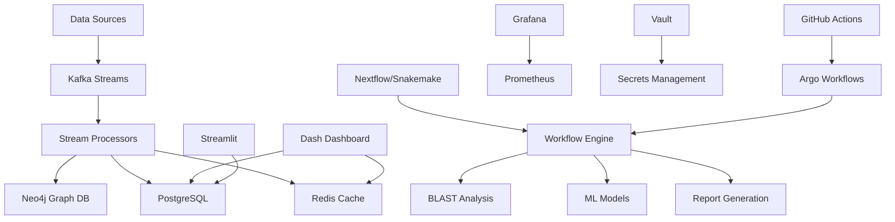

# Cancer Genomics Analysis Suite (in-package doc index)

**Authoritative project docs** live in the repository root: [../../README.md](../../README.md), [../../docs/README.md](../../docs/README.md), and [../../docs/installation.md](../../docs/installation.md). The sections below are a **high-level capability overview**; commands and repository paths may be abbreviated.

---

A cloud-oriented platform for cancer genomics analysis, with bioinformatics pipelines, machine learning, and interactive visualizations.

## 🧬 Overview

The Cancer Genomics Analysis Suite is designed to process, analyze, and visualize cancer genomics data at scale. It provides:

- **Real-time mutation analysis** with Kafka streaming
- **Graph-based analytics** using Neo4j
- **Machine learning predictions** for cancer outcomes
- **Interactive dashboards** with Dash, Grafana, and Streamlit
- **Automated workflows** with Nextflow and Snakemake
- **Cloud-native deployment** with Kubernetes and Helm

## 🚀 Quick Start

### Prerequisites

- Kubernetes cluster (v1.24+)
- Helm 3.x
- Docker
- kubectl configured

### Installation

1. **Clone the repository**
   ```bash
   git clone https://github.com/jbInf-08/cancer_genomics_analysis_suite.git
   cd cancer_genomics_analysis_suite
   ```

2. **Install dependencies**
   ```bash
   helm repo add prometheus-community https://prometheus-community.github.io/helm-charts
   helm repo add grafana https://grafana.github.io/helm-charts
   helm repo add bitnami https://charts.bitnami.com/bitnami
   helm repo update
   ```

3. **Deploy the application**
   ```bash
   helm install cancer-genomics ./helm/cancer-genomics-analysis-suite \
     --namespace cancer-genomics \
     --create-namespace \
     --values ./helm/cancer-genomics-analysis-suite/values.yaml
   ```

4. **Access the dashboard**
   ```bash
   kubectl port-forward svc/cancer-genomics-web 8050:8050
   ```
   Open http://localhost:8050 in your browser.

## 📊 Features

### Real-time Processing
- **Kafka Streams**: High-throughput mutation data processing
- **Neo4j Integration**: Graph-based mutation analysis
- **Prometheus Metrics**: Real-time monitoring and alerting

### Bioinformatics Pipelines
- **BLAST Alignment**: Sequence similarity analysis
- **Variant Annotation**: Functional impact prediction
- **Pathway Analysis**: Biological pathway enrichment

### Machine Learning
- **Anomaly Detection**: Identify unusual mutation patterns
- **Outcome Prediction**: Predict cancer progression and treatment response
- **Risk Assessment**: Calculate patient risk scores

### Visualization
- **Interactive Dashboards**: Real-time data exploration
- **Grafana Monitoring**: System and application metrics
- **Streamlit Apps**: Custom analysis workflows

## 🏗️ Architecture



## 📚 Documentation

### Core Components

- [**Stream Processing**](stream-processing.md) - Kafka-based real-time data processing
- [**Graph Analytics**](graph-analytics.md) - Neo4j mutation network analysis
- [**ML Models**](ml-models.md) - Machine learning for cancer prediction
- [**Workflows**](workflows.md) - Nextflow and Snakemake pipelines

### Deployment

- [**Kubernetes Setup**](kubernetes-setup.md) - Cluster configuration
- [**Helm Charts**](helm-charts.md) - Application deployment
- [**Monitoring**](monitoring.md) - Prometheus and Grafana setup
- [**Security**](security.md) - Vault and SealedSecrets

### Development

- [**API Reference**](api-reference.md) - REST API documentation
- [**Contributing**](contributing.md) - Development guidelines
- [**Testing**](testing.md) - Test suite and CI/CD
- [**Troubleshooting**](troubleshooting.md) - Common issues and solutions

## 🔧 Configuration

### Environment Variables

| Variable | Description | Default |
|----------|-------------|---------|
| `KAFKA_BOOTSTRAP_SERVERS` | Kafka broker addresses | `kafka:9092` |
| `NEO4J_URI` | Neo4j connection string | `bolt://neo4j:7687` |
| `POSTGRES_HOST` | PostgreSQL host | `postgresql` |
| `REDIS_HOST` | Redis host | `redis-master` |
| `VAULT_ADDR` | Vault server address | `http://vault:8200` |

### Helm Values

Key configuration options in `values.yaml`:

```yaml
# Application settings
web:
  replicaCount: 3
  resources:
    limits:
      cpu: 1000m
      memory: 2Gi

# Database settings
postgresql:
  enabled: true
  auth:
    postgresPassword: "secure-password"

# Monitoring
monitoring:
  enabled: true
  grafana:
    enabled: true
```

## 📈 Monitoring

### Metrics

The application exposes Prometheus metrics for:

- **Application Metrics**: Request rates, response times, error rates
- **Business Metrics**: Mutation counts, analysis rates, patient statistics
- **Infrastructure Metrics**: CPU, memory, disk usage
- **Custom Metrics**: ML model performance, workflow execution times

### Dashboards

- **Overview Dashboard**: System health and key metrics
- **Mutation Analysis**: Real-time mutation processing
- **Kafka Streams**: Message throughput and lag
- **Neo4j Performance**: Graph database metrics

### Alerting

Configured alerts for:

- **Critical Mutations**: High-severity mutations detected
- **System Health**: Service downtime, high error rates
- **Performance**: High latency, resource exhaustion
- **Security**: Unauthorized access attempts

## 🔒 Security

### Authentication

- **OAuth2**: Google, GitHub, Microsoft integration
- **JWT Tokens**: Secure API authentication
- **RBAC**: Role-based access control

### Secrets Management

- **Vault Integration**: Centralized secret storage
- **SealedSecrets**: Encrypted Kubernetes secrets
- **Certificate Management**: Automated TLS certificates

### Network Security

- **Network Policies**: Pod-to-pod communication control
- **mTLS**: Mutual TLS for service communication
- **WAF**: Web Application Firewall protection

## 🚀 Deployment

### Development

```bash
# Local development with Docker Compose
docker-compose up -d

# Run tests
pytest tests/

# Start development server
python run_flask_app.py
```

### Staging

```bash
# Deploy to staging
helm upgrade --install cancer-genomics-staging ./helm/cancer-genomics-analysis-suite \
  --namespace cancer-genomics-staging \
  --create-namespace \
  --values ./helm/cancer-genomics-analysis-suite/values-staging.yaml
```

### Production

```bash
# Deploy to production
helm upgrade --install cancer-genomics-prod ./helm/cancer-genomics-analysis-suite \
  --namespace cancer-genomics-prod \
  --create-namespace \
  --values ./helm/cancer-genomics-analysis-suite/values-production.yaml
```

## 🤝 Contributing

We welcome contributions! Please see our [Contributing Guide](contributing.md) for details.

### Development Setup

1. Fork the repository
2. Create a feature branch
3. Make your changes
4. Add tests
5. Submit a pull request

### Code Style

- **Python**: Black, isort, flake8
- **YAML**: yamllint
- **Markdown**: markdownlint

## 📄 License

This project is licensed under the MIT License - see the [LICENSE](LICENSE) file for details.

## 🙏 Acknowledgments

- **Bioinformatics Community**: For open-source tools and datasets
- **Kubernetes Community**: For container orchestration
- **Prometheus/Grafana**: For monitoring and visualization
- **Neo4j**: For graph database technology

## 📞 Support

- **Documentation**: [docs.cancer-genomics.com](https://docs.cancer-genomics.com)
- **Issues**: [GitHub Issues](https://github.com/your-org/cancer-genomics-analysis-suite/issues)
- **Discussions**: [GitHub Discussions](https://github.com/your-org/cancer-genomics-analysis-suite/discussions)
- **Email**: support@cancer-genomics.com

---

**Version**: 1.0.0  
**Last Updated**: 2024-01-15  
**Maintainer**: Cancer Genomics Team
